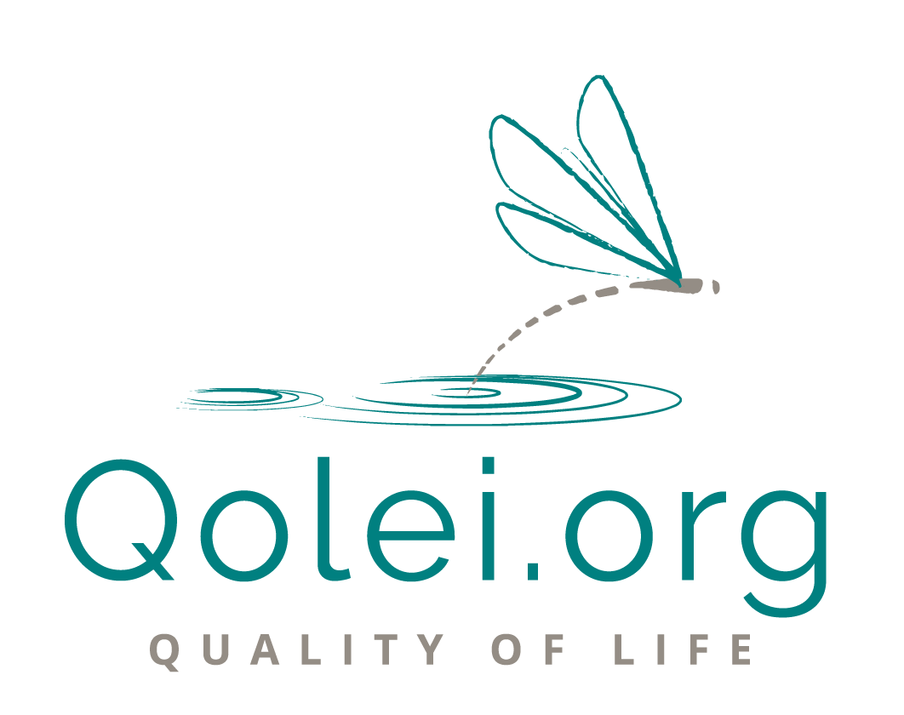

# Welcome to the Qolei Wiki

The Quality of life economic initiative is about a new way of living, a new way of working, a new way of being in the global economy. Some of the aspects require trust, transparency and privacy, all features facilitated by the blockchain technology.

However, it’s not the internet, an algorithm or a software platform that will change society. People are the only ones able to change it.
We make use of technology as a lever to lower the barriers that make it harder to implement change but ultimately, we as a society will evolve in the same way we have been for thousands of years, by talking to each other, telling stories and working together towards a common goal.

Technology such as the internet works as an amplifier, it does not choose what stance and opinion it amplifies. Let us use it to spread stories of awareness, connection and growth.

Technology such as the blockchain works as an amplifier, it does not choose what is done with privacy and independence. Let us use it to spread the idea that we can build a society where we do not have to look up to someone for guidance but where we all share a moral compass as guide.

In this project we will use blockchain and other technology as enabler, not as a goal. In a way the QOLEI is a hybrid implementation of a DAO, let’s call it a Distributed Autonomous Human Organisation, DAhO.

This wiki contains much of the qolei content and resources available publicly.

## Discussions are available here for participants to discuss changes, issues, or other tensions related to the QOLEI governance and economic models and agreements. 

Navigate <a href="https://github.com/qolei/qolei-wiki/issues" target="_blank">Here</a> and click on the green "New Issue" button. 

Title your discussion and describe your points and click on "Submit new issue". 

Depending on your settings you'll get notifications about activity on your submission. 

Thanks for participating. 

For our website visit [qolei.org](https://qolei.org).

## **What does the wiki contain?**
You can use the menu to the left to navigate the wiki. Here is a brief summary of the contents:

- **<u>Documentation</u>**

    - Documents and papers related to the project
    - The economic model
    - The governance models
	- The code of conduct
	- The legal stuff

- **<u>Initiatives</u>**

    - Specific information regarding the Qolei initiatives
	- The QOLiHoP initiative specifics

- **<u>Investment projects</u>**

    - Specific information regarding the Qolei investment projects

- **<u>Roles</u>**

    - The currently vacant roles for Qolei or one of the initiatives

- **<u>Blog posts</u>**

    - Index and links to all of our blog posts

- **<u>Press</u>**

    - Qolei Press Kit for Press/Media
    - Some media mentions
    - Contact information for media/press inquiries